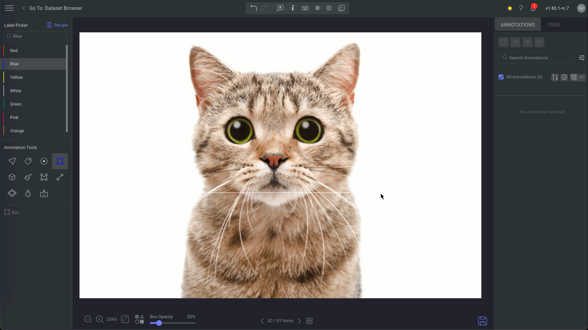

# SAM2 Model Interface

The Segment Anything Model (SAM) in the Image Studio is a powerful tool designed to make the process of annotating images for instance segmentation both efficient and precise. SAM uses advanced machine learning algorithms to automate and assist with the segmentation process. For more information, refer to the [Segment Anything](https://segment-anything.com/). 

This repository contains the model interface for
the [SAM2](https://github.com/facebookresearch/sam2) model in the Dataloop platform.

## Usage in Dataloop

In Dataloop, Grounded sam can be used in multiple applications:

* Convert Box Annotations to Segmentation
* Convert Box Annotations to Polygon
* Auto Segmentation
* AI Tracker

### Convert Box Annotations to Segmentation

Dataloop offers advanced tools to enhance annotation precision and streamline workflows, leveraging the power of SAM2 models to convert bounding box annotations into segmentation masks. This conversion provides pixel-level classification, which is essential for detailed object recognition tasks.

#### The Convert Box to Segmentation feature allows users to:

- **Automatically generate segmentation masks**: Transform bounding boxes into semantic segmentation masks, enabling each pixel within the box to receive a specific label.
- **Achieve high annotation accuracy**: By converting to pixel-level classification, this feature ensures precise object representation, especially valuable for applications requiring fine-grained detail.
- **Enhance efficiency**: Reduces manual annotation effort by automatically generating detailed object boundaries.

To convert Box annotation to Segmentation:

1. In the Image Annotation Studio, select the **Bounding Box** annotation.
2. Click on the three-dot action button above the annotations list.
3. Select the **Box to Segmentation** option. The system will create a semantic layer corresponding to the object's area within the bounding box. 

### Convert Box Annotations to Polygon

Dataloop’s Convert Box to Polygon feature, powered by SAM2 models, enhances annotation accuracy by transforming box annotations into precise polygon shapes. This tool converts a selected bounding box into a polygon that closely contours the object within, making it particularly beneficial for objects with irregular shapes where a rectangle may not effectively represent boundaries. 

To convert Box annotation to Polygon:

 1. Select the desired bounding box annotation.
 2. Click on the three-dot action button located above the annotations list, and choose the **Box to Polygon** option. The system will automatically generate a polygon that tightly fits the object's edges, improving annotation accuracy.

### Create Auto Segmentation

Segmentation feature, which uses machine learning to streamline and enhance the efficiency of semantic segmentation tasks. Here's how SAM2 supports and improves auto-segmentation:

- **Precise Boundary Detection**: Accurately outlines object edges, reducing manual adjustments.
- **Handling Complex Scenes**: Separates multiple or overlapping objects with ease.
- **Increased Efficiency**: Speeds up annotation by automating pixel-accurate segmentation, saving time.
- **Consistency**: Ensures uniform segmentation across frames or multiple items.
- **Interactive Refinement**: Allows annotators to adjust auto-segmentation for perfect accuracy.
- **Scalability**: Efficiently manages large datasets, making high-quality segmentation feasible at scale.

To use the Auto Segmentation feature:

1. Select the auto-segmentation tool.
2. Draw a box around an object to get an initial segmentation.
3. Make changes to the initial segmentation:
    - Click once on an area with no segmentation to have it added to the initial results.
    - Click on the segmented area to have it deducted.
    - Repeat the process until you are satisfied with the segmentation.
4. Click the checkmark to accept this segmentation and close the box, or X to undo it entirely.

### AI Tracker in the Video Annotation Studio

In Dataloop’s Video Annotation Studio, the SAM2 model significantly enhances object tracking through the AI Tracker tool. The SAM2 model, combined with AI-driven tracking, allows annotators to streamline the tracking of objects across video frames, which traditionally requires extensive manual effort.

Here’s how the SAM2 model improves the annotation process with AI Tracker:

- **Automatic Tracking**: SAM2 allows the AI Tracker to follow selected objects throughout the video, reducing the need for frame-by-frame annotation.
- **Adaptive Accuracy**: SAM2 adapts to object changes in position, scale, or orientation, maintaining accurate tracking even with complex movements.
- **Minimal Manual Corrections**: The AI Tracker, with SAM2 support, minimizes manual adjustments, efficiently handling shifts in lighting or background.

To use the AI Tracker feature:

1. In the Video Annotation Studio, go to the Timeline section.
2. Click on the Linear option.
3. Select the **AI Tracker** from the list.
4. Select the Bounding Box tool and start annotating an object.
5. Once annotation is complete, save it, then click the Forward Frame icon to view the annotation across multiple frames

## Acknowledgments

This project builds upon the open-source library [SAM2](https://github.com/facebookresearch/sam2), created by Meta Platforms, Inc. and affiliates. SAM2 is licensed under the [Apache License, Version 2.0](https://www.apache.org/licenses/LICENSE-2.0).

The SAM2 library enables advanced segmentation tasks for images and videos using the Segment Anything Model (SAM). For more details, visit the [SAM2 GitHub repository](https://github.com/facebookresearch/sam2).
