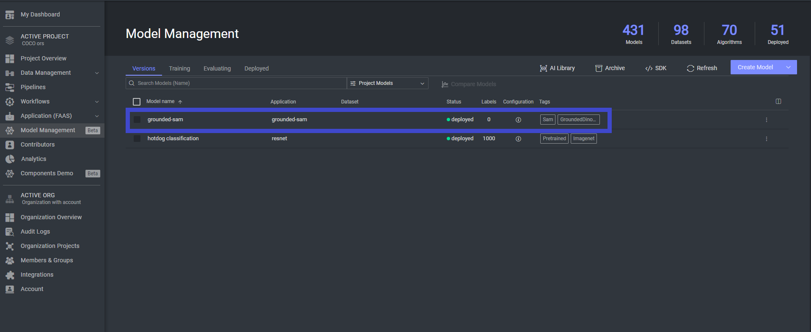
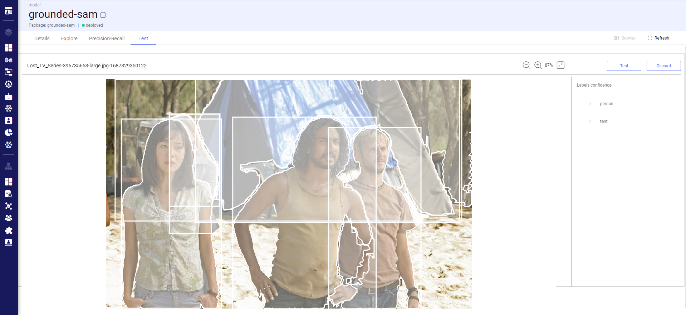
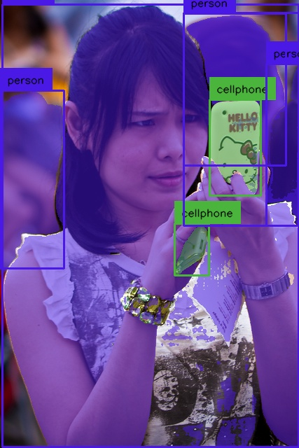

# Grounded SAM Model Interface

This repository contains the model interface for
the [Grounded SAM](https://github.com/IDEA-Research/Grounded-Segment-Anything) model in the Dataloop platform.
Grounded SAM is a combination of [Grounding DINO](https://github.com/IDEA-Research/GroundingDINO)
and [Segment Anything](https://github.com/facebookresearch/segment-anything) which aims to detect and segment anything
based on text inputs. We will continue to improve it and create additional interesting demos based on this foundation.

## Introduction

We created an integration for the Grounded SAM in Dataloop's model management. To start working with Grounded SAM:

1. Clone the public model to your Dataloop project.
   

2. Edit the model configuration with the labels you want to predict (these will be used as prompts for Grounding DINO, see full
   example [here](https://github.com/IDEA-Research/Grounded-Segment-Anything#running_man-grounded-sam-detect-and-segment-everything-with-text-prompt)).
   `classes` is a dictionary for each prompt class as key and min/max area of the annotation as the values:
   for example:

```python
model = dl.models.get(model_id='')
model.configuration['classes'] = {'person': {'min_area': 10,
                                             'max_area': 500},
                                  'tent': {'min_area': 10,
                                             'max_area': 500}}
model.update()
```
   
   Default min/max are zero and np.inf respectively.  

3. Deploy the model to create a running FaaS for prediction.
4. Go to the "Test" tab and try it out!


## Requirements

To use the Grounded SAM model interface on the platform, you will need:

- a Dataloop platform account

## Local Run

If you want to run the Grouded SAM locally you can follow the instruction in
the [Grounded SAM GitHub](https://github.com/IDEA-Research/Grounded-Segment-Anything) repo, or follow our instructions:

1. Clone the repository:

```shell
git clone https://github.com/dataloop-ai-apps/grounded-sam-adapter
```

2. Navigate to the project directory:

```shell
cd grounded-sam-adapter
```

3. Check out the `demo.py` or other demo scripts
   from [Grounded SAM](https://github.com/IDEA-Research/Grounded-Segment-Anything/tree/main).
4. Run the following code:

```python
from adapters.grounded_sam_adapter.grounded_sam_adapter import GroundedSam
from PIL import Image
import numpy as np

gs = GroundedSam()
gs.load(None)
image = Image.open('assets/000000001296.jpg')
annotations = gs.predict([np.asarray(image)],
                         save_results=True,
                         classes=['person', 'cellphone'])
```

And the model output will be saved to `detections.jpg`:



## Acknowledgements

- [Segment Anything](https://github.com/facebookresearch/segment-anything)
- [Grounding DINO](https://github.com/IDEA-Research/GroundingDINO)
- [Grounded Segment Anything](https://github.com/IDEA-Research/Grounded-Segment-Anything/tree/main)

## Contributions, Bugs and Issues - How to Contribute

We welcome anyone to help us improve this app.  
[Here's](CONTRIBUTING.md) detailed instructions to help you open a bug or ask for a feature request.

## Citation

```BibTex
@article{kirillov2023segany,
  title={Segment Anything}, 
  author={Kirillov, Alexander and Mintun, Eric and Ravi, Nikhila and Mao, Hanzi and Rolland, Chloe and Gustafson, Laura and Xiao, Tete and Whitehead, Spencer and Berg, Alexander C. and Lo, Wan-Yen and Doll{\'a}r, Piotr and Girshick, Ross},
  journal={arXiv:2304.02643},
  year={2023}
}

@article{liu2023grounding,
  title={Grounding dino: Marrying dino with grounded pre-training for open-set object detection},
  author={Liu, Shilong and Zeng, Zhaoyang and Ren, Tianhe and Li, Feng and Zhang, Hao and Yang, Jie and Li, Chunyuan and Yang, Jianwei and Su, Hang and Zhu, Jun and others},
  journal={arXiv preprint arXiv:2303.05499},
  year={2023}
}
```